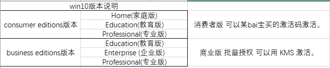
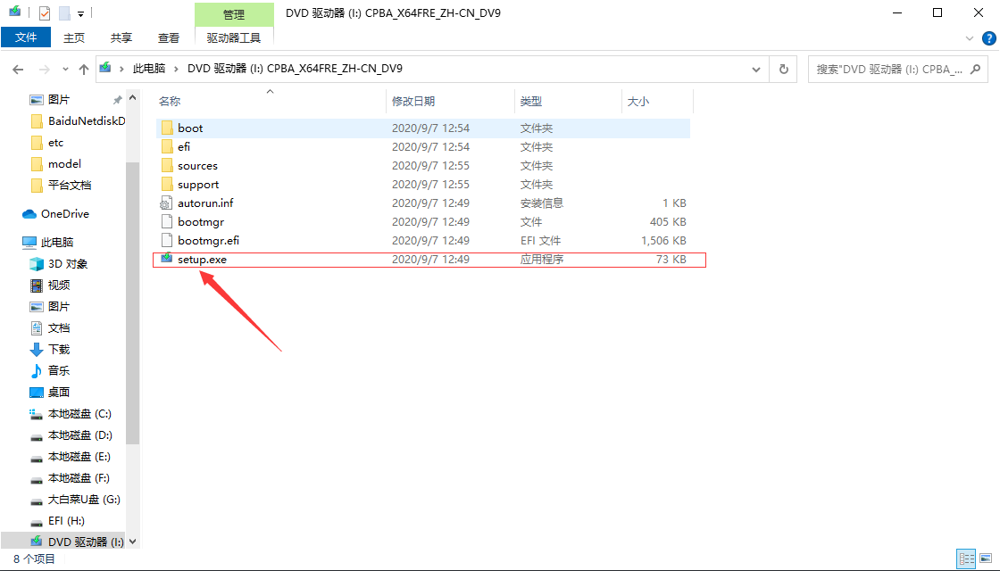
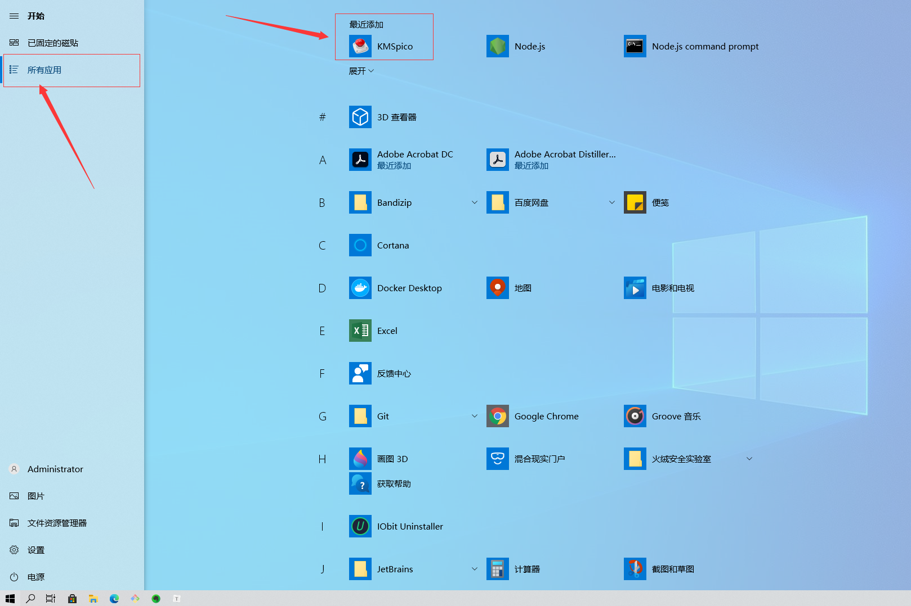

# Win10安装

## 1.win10版本说明

win10版分为两大类

consumer editions版本

> 包含Home(家庭版)、Education(教育版)、Professional(专业版)；消费者版 可以某bai宝买的激活码激活。

business editions版本

> 包含Education(教育版)、Enterprise (企业版)、Professional(专业版)；商业版 批量授权 可以用 KMS 激活。

注：推荐安装商业版的Professional(专业版)，可直接用kms一键破解，注意kms破解会存在一定的风险，还是推荐正版系统。

## 2.获取win10的镜像文件

> 推荐网站[msdn](https://msdn.itellyou.cn/)获取镜像文件，版本比较全面。

## 3.选择win10的安装方式

​	win10可以在本机运行下载好的镜像文件内的文件进行安装，前提是电脑能正常开机，可以打开镜像文件，也可以通过工具制作win10系统安装U盘，通过系统U盘进行安装，U盘安装一般常用于电脑系统损坏无法正常开机，可以进入bios模式通过制作好的系统盘进行重装系统。

### 3.1  本机运行镜像文件安装

​	打开下载好的镜像文件（后缀为iso），然后双击文件里的文件，然后按照提示进行操作，可能需要等待较长的时间。

### 3.2 通过U盘安装

​	参照此方法：https://zhuanlan.zhihu.com/p/84995183

## 4.激活win10系统
> 目前win10激活有三个途径，
>
> 首先是去win10的官方店购买正版，价格大约在一千左右，
>
> 然后是去淘宝店铺购买激活码，相比第一种会便宜很多，大概几十块钱，
>
> 最后是使用vms进行破解，百度或者使用下面提供的链接下载Kms工具（链接中包含有一套office，office亦可通过Kms破解）进行破解，破解原理自行百度

链接：https://pan.baidu.com/s/1f3DI2DbG1MO7fErhUlNfVQ

提取码：wnye

下载完成后，解压下载文件，启动文件内的.exe文件，按照操作安装，安装完成后，在开始的所有应用中找到最近添加的第一个，启动，点击红色按钮，激活完成

